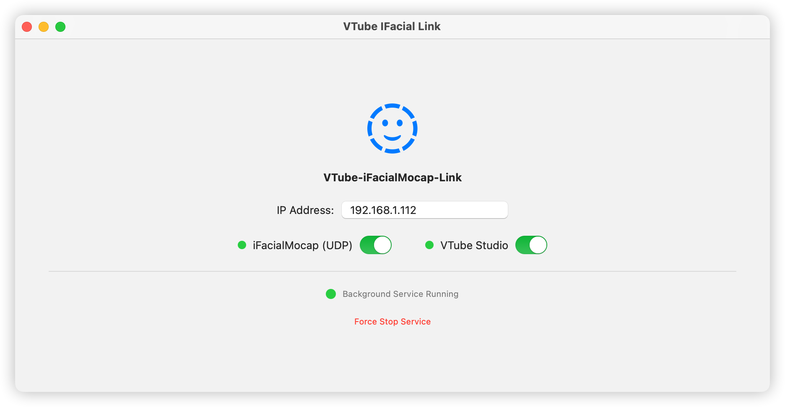
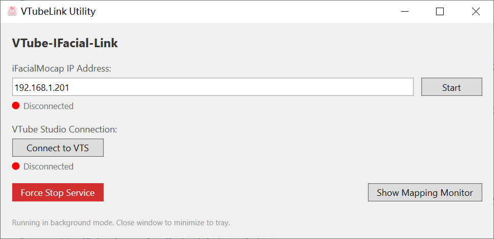

# VTube-IFacial-Link

A **VTube Studio** plugin that bridges facial tracking from **iFacialMocap** (iOS), enabling full Apple ARKit facial tracking features.

Originally a Python project, now natively ported to **Swift (macOS)** and **C# WPF (Windows)**. 





## Quick Start Guide

1.  Ensure **"Start API (allow plugins)"** is enabled in VTube Studio settings (default port: 8001).
2.  Enter the IP address provided by **iFacialMocap** on your iPhone.
3.  Toggle the connection switches for both iFacialMocap and VTube Studio. Green indicators signify a successful connection. Remember to click "Allow" in VTube Studio when prompted for the first time.
4.  Use the **Mapping Monitor** to visualize real-time parameter data and system logs.

## Tips on Background Service

The application is designed to stay out of your way while you stream:

-   **On macOS**: When you start the connection, a background service is launched. Even if you close the main window, the service remains active. Use the "Force Stop Service" button in the UI to completely terminate it.
-   **On Windows**: The app uses a **System Tray** logic. 
    -   Closing the window will **minimize** it to the system tray (look for the VTubeLink icon near your clock).
    -   Double-click the tray icon to restore the window, or right-click for a quick menu.
    -   To fully exit the app, use the "Exit" option in the tray's right-click menu.

## Build from Source (Development)

### macOS (Swift)
**Requirements**: macOS 12+, Xcode 13+.
1.  Navigate to the `MacApp` directory.
2.  Run the packaging script:
    ```bash
    ./build_app.sh
    ```
3.  The standalone bundle will be created at `MacApp/build/VTube-IFacial-Link.app`.

### Windows (C# / WPF)
**Requirements**: Windows 10/11, Visual Studio 2022, .NET 9.0 SDK.

We provide a PowerShell script `build_win.ps1` in the `WinApp` folder with two main distribution modes:

1.  **Standalone (Recommended for users)**:
    Includes the .NET 9 runtime inside the `.exe`. No installation required (~170MB).
    ```powershell
    .\build_win.ps1 -Mode Standalone
    ```

2.  **Lightweight (For developers)**:
    A tiny file (~2MB), but Requires [.NET 9 Desktop Runtime](https://dotnet.microsoft.com/en-us/download/dotnet/9.0) installed on the target machine.
    ```powershell
    .\build_win.ps1 -Mode Lightweight
    ```

Find your application in the `dist/` folder at the project root.

## Supported Parameters

The plugin supports all 52 Apple ARKit blendshapes and standard VTube Studio parameters. Refer to [this](https://github.com/xuan25/VTube-IFacial-Link) for details.